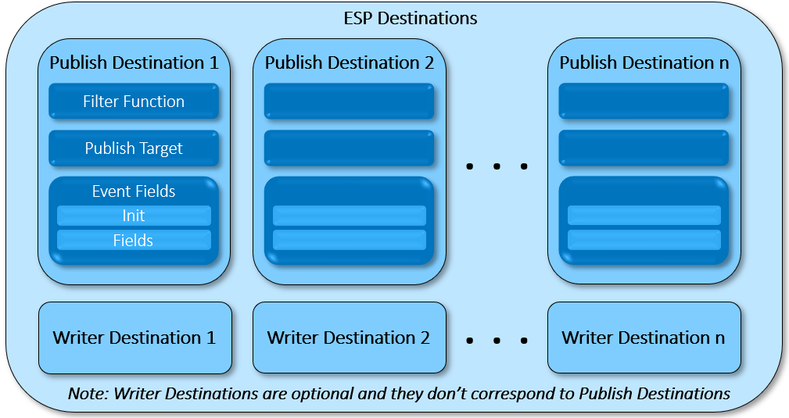

# ESP Routers

   

This repository contains a description of how ESP Routers work, along with simple examples that can easily be extended to more complex use cases

## Overview

As the capabilities of our Event Stream Processing Engine have expanded with each new release, so have the ways in which customers want to use it.
Lately we see a lot of demand for breaking up streaming applications into modules, which can be a single project or a group of projects. 
The ESP Router is a tool which is used to connect ESP modules together that may live on different hosts. Using ESP Routers allows applications to scale 
more easily by making it very easy to add/remove modules and to change a module without disrupting the others.

### Router Basics


The ESP Router is an XML document similar to a typical ESP project a user would create, and is run using dfesp_xml_server as follows:

`dfesp_xml_server -http 41001 -pubsub 41002 -model file://router.xml`

Let's consider a simple example in which we are connecting two streaming models together and the output of one streaming model will be the input of the other. In the case that the router has already started correctly and is running, if any of the servers go down,
the router will keep pinging the down server(s) until they are brought back up. 

The root element of the router XML is `<engine>`. Within the engine there can be one or more routers. 
There are 3 main parts to a router: Engine, Destination, and Route Definitions.

### ESP Engines

Here is where you list the engines that will be involved in the routing of events. You simply give the engine a name for reference, then specify the host ip address and pubsub port of that engine. Here is an example:

```
<esp-engines>
  <esp-engine name=‘esp1’ host=‘host1.ip’ port=‘pubsub_port_from_host1’>
  <esp-engine name=‘esp2’ host=‘host2.ip’ port=‘pubsub_port_from_host2’>
</esp-engines>
```

### ESP Destinations



This section is where most of the cool features of the ESP Router are. There are two types of ESP destinations: Publish and Writer. The `<publish-destination>` element is used to
connect one ESP project with another, and the `<writer-destination>` element is used to direct the output of a project to a file or the console.

#### Publish Destinations

In a `<esp-destinations>` element, there can be many `<publish-destination>` elements. You have to define a `<publish-target>`, but you have the option of defining a filter,
 creating new fields, and initializing variables that you can use for calculations within the router.

##### Filter Functions

The first element is the filter function, and it is optional. If the function evaluates to true, then the event passes the filter. In contrast to the Filter window, we use the functions from the Functional window, rather than the Expression Language. Here is an example of a simple filter in which we only want events to pass when the field 'number' is greater than 2, notice that if we reference a field, we have to use a '$':

```
<filter-func>
  gt($number,2)
</filter-func>
```

##### Publish Targets

The next element is `<publish-target>` and it is required. The most basic implementation is to simply specify the names of the destination engine, project, continuous query, and window.

```
<publish-target>
  <engine-func>esp2</engine-func>
  <project-func>Project2</project-func>
  <contquery-func>cq1</contquery-func>
  <window-func>Source1</window-func>
</publish-target>
```

There is a lot more we can do with the publish-target element. Each of the elements inside can take a function that can be used to specify the target based on what the function returns. Suppose that we have an arrangement as shown below. We have a source project and we want to route the data to the appropriate module, where the other modules are separate projects.


In our case, we want to direct events to their respective modules based on the field "number". Let's say that we want these conditions on the events:
```
number < 10        -->  Module_0
10 <= number < 30  -->  Module_1
number >= 30       -->  Module_2
```
With these conditions, we can write a publish target like this:
```
<publish-target>
  <engine-func>esp2</engine-func>
  <project-func>ifNext(lt($number,10),'Module_0',and(gte($number,10),lt($number,30)),'Module_1',gte($number,30),'Module_2')</project-func>
  <contquery-func>cq1</contquery-func>
  <window-func>Source1</window-func>
</publish-target>
```
In the above code, we are using the function `ifNext()`, which takes pairs of arguments. If the first argument of the pair evaluates to true, then ifNext() returns the second. Obviously, we can use functions like this to route events to different engines, projects, continuous queries, and windows.

##### Event Fields

This part of the destination definition is optional and is a departure from the previously available tools used to connect projects. When using project-to-project connectors and adapters, it is required that the windows being connected have exactly the same schemas. With the ESP Router, we are able to create new fields within the router. There are two parts to this element: Init and Fields.

###### Init

In this element, we can create variables and initialize them. These can be strings, numbers, the output of functions, etc., and we don't have to specify the data type. These values, once created, will not change. Here is an example:
```
<init>
  <value name='foo'>1</value>
  <value name='bar'>concat($foo,'st place')</value>
</init>
```
We are creating two variables here. The first is a number, and the second is a string. The second value is concatenating the first value with a string, and the result will be the string: "1st place".

These variables can be used anywhere in the `<event-fields>` element as long as they are referenced on a line below the one in which they were created.

###### Fields

We can use this element to create new fields using the following:
```
Numbers, strings, and functions
Variables created in <init>
Existing fields in input events
```

Here is an example:
```
<fields>
  <field name='new_field_1'>sum($existing_field,$foo,8)</field>
  <field name='new_field_2'>guid()</field>
</fields>
```
In "new_field_1", we are summing the value of "existing_field", the initialized variable "foo", and the number 8. 
Notice again that we use a "$" to reference fields and variables. In "new_field_2" we are using the function `guid()` which yields a globally unique identifier. 
The name that we give to each field must match a field in the window to which the events are being routed, but if the destination window doesn't contain a field 
matching the one we create in the router, events will still be routed but without that new field.

Let's look at a case in which we want to count the events that pass through our router. We can do this without even initializing the counter in `<init>`:
```
<fields>
  <field name='counter'>sum($counter,1)</field>
</fields>
```
Notice that the name of the field and the name of the thing we are incrementing are the same.

#### Writer Definition

Using the optional `<writer-destination>` element, we can direct the output of an ESP project to a file or the console. When defining a Writer Destination, we give it a name
for reference, a format, and optionally a date format. The available formats are XML, JSON, and CSV. Here is an example of a Writer Destination:

```
<writer-destination name='writer1' format='json'>
  <file-func>
    string('./test.json')
  </file-func>
</writer-destination>
```
Notice that to specify the destination path and file, we use functions. To write the output to the console, where the console is the one running the router, it would look like this:
```
<writer-destination name='writer2' format='csv'>
  <file-func>
    string('_console')
  </file-func>
</writer-destination>
```

### Route Definitions

This is the final element of a router and it is a little bit different than the other elements, so it's definitely worth some extra attention. 
Within the `<esp-routes>` element, we can have one or more `<esp-route>` elements. Let's look at an example of a route definition:
```
<esp-route name='route1' to='destination1' snapshot='true'>
  <engine-expr>esp1</engine-expr>
  <project-expr>Router_1a</project-expr>
  <contquery-expr>cq1</contquery-expr>
  <window-expr>Compute1</window-expr>
  <type-expr>compute<type-expr>
</esp-route>
```
Let's break break down the start tag of the `<esp-route>` element. The attributes of the `<esp-route>` element are: name, to, and snapshot. The "name" attribute is only for reference. The "to" attribute is for specifying the destination,
which will either be a Publish Destination or a Writer Destination that we have defined above in this router. The "snapshot" attribute is used to route events that are retained
before the router is started. For example: in the above code snippet, if we set snapshot to false, the router will only route events that made it into the Compute1 window after
the router was started. Likewise, if snapshot was set to true, upon starting the router, events already being retained in Compute1 would be routed to their destination.

The elements within `<esp-route>` all take regular expressions to specify where the events to be routed are coming from. Here is an example:
```
<esp-route name='route1' to='destination1' snapshot='true'>
  <engine-expr>edge-node[0-9]</engine-expr>
  <project-expr>fault-predict</project-expr>
  <contquery-expr>cq1</contquery-expr>
  <type-expr>aggregate|pattern<type-expr>
</esp-route>
```
In the above example, the regex inside `<engine-expr>` will match any engine defined in this router with a name like "edge-node" with a single digit between 0 and 9 following, such
as "edge-node2" or "edge-node8". If we wanted to match engines "edge-node00" through "edge-node99", we would use this regex:
```
<engine-expr>edge-node[0-9][0-9]</engine-expr>
```
Notice that the `<window-expr>` element is missing from the above esp route. This means that all windows within the specified engines/projects/continuous queries in 
this esp route are selected for event routing. The element `<type-expr>` is used to select which types of windows to take events from. In this example, the regex 
`aggregate|pattern` will match all Aggregate and Pattern windows, regardless of the names of the windows. To summarize the above esp route, events will be routed to "destination1"
from all Aggregate and Pattern windows within continuous queries named "cq1", within projects named "fault-predict", within engines named "edge-node0" through "edge-node9".

Normally in ESP, we have to be very specific about where events come from and where they are going. This is not the case when
defining routes. The less specific we are, the more of a mess there will be. For example: if we specify the name of an engine, a project, a continuous query, but we leave out
the `<window-expr>` element, then all windows within the specified continuous query, project, and engine will be routed to the destination. As an extreme example, consider this
esp route:
```
<esp-route name='route1' to='destination1'>
</esp-route>
```
What the above code snippet will do, since we specified nothing, is take every event from every window, in every continuous query, in every project, in every engine defined in the router, and route it
to the destination, which will necessarily be among the windows the router is taking events from. In short, this will create an infinte loop in which events are going everywhere.
Obviously, we want to avoid scenarios like this.

Using regular expressions can be challenging, so it's definitely recommended that we remind ourselves how to use them when building a router.

### Conclusion

The ESP router is the best tool for modularizing ESP applications because of its flexibility and wide range of features. Topics such as using routers in a High Availability
implementation, and with Docker and Kubernetes will be addressed in a separate repo.

### Prerequisites

[SAS Event Stream Processing 6.2](https://www.sas.com/en_us/software/event-stream-processing.html)

### Running

Refer to the [Running the ESP Routers Project](doc/readme.md) document for steps to run this project.

## Contributing

> We welcome your contributions! Please read [CONTRIBUTING.md](CONTRIBUTING.md) for details on how to submit contributions to this project. 

## License

> This project is licensed under the [Apache 2.0 License](LICENSE).

## Additional Resources

* [SAS Event Stream Processing 6.2 Documentation](https://go.documentation.sas.com/?cdcId=espcdc&cdcVersion=6.2&docsetId=espov&docsetTarget=home.htm&locale=en)
